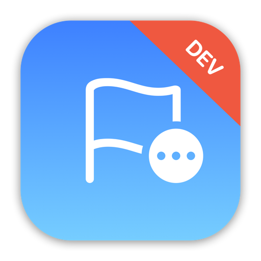

    

    
    
    

  ***Note**: The app icon above should only be used for development purposes only, not for submission to the App Store due to the license on SF Symbols and Emoji.*

 

Flagnation is a quiz game app designed to test players on their knowledge of the world's nation flags.

The app interface contains a randomly generated country name, prompting the player to choose 1 of the 3 given choices of flag image buttons. There are a total of 8 questions per game round and each correct answer will reward the player +12.5% score points, totaling up the max score to 100% if all answers for the current game round are correct.

When the current game round ends, the player will be shown an alert prompt of their overview score with a button to reset the game and start a new round.

An example, the app generated a country name and displays "*Germany*" and also randomly generate & display 3 flag image buttons for the player to choose. If the player chose the correct flag that matches the country name "*Germany*", the player scores +12.5%. If the player chose a flag that doesn't match, the player will lose -12.5% off their current total score. If their score is already at 0%, a wrong answer will not further subtract their score to a negative value and will instead just remain at 0%.

## App preview

https://user-images.githubusercontent.com/65307853/182215502-ef6c35be-ae91-4e47-a7cc-c7a9a4da6e38.mp4

## Trying it yourself

Flagnation is written using Xcode 13.2 and Swift 5.0. To try it out, you can clone this project and build it immediately by opening `Flagnation.xcodeproj`.

As far as I know the app feature is complete, but there are likely to be errors all over the place at least to begin with – if you hit any problems, either building or running the app, please let me know.

## Important notes on usage

Keep in mind that this app is simply a project designed and built for my own personal educational purposes only. The sole purpose for this app project was to gain practical experience in building an app in iOS with Swift & SwiftUI. The state of this app was never meant to be production-ready, published onto the App Store, or to be monetized in any way, shape, or form.

If you wish to do any of the above, you will have to make some changes to the app before submitting to the App Store for approval. Please keep in mind of any potential violation of third-party license, such as the usage of SF Symbols and/or Emoji of the app icon.

## Credits

Swift, the Swift logo, Xcode, Instruments, SF Symbols, Emoji, Cocoa Touch, iPhone, iPad, Safari, App Store, watchOS, tvOS, Mac and macOS are trademarks of Apple Inc., registered in the U.S. and other countries.

## License 

This project is under the terms of the MIT license. For more information, please refer to the license [documentation](LICENSE).
